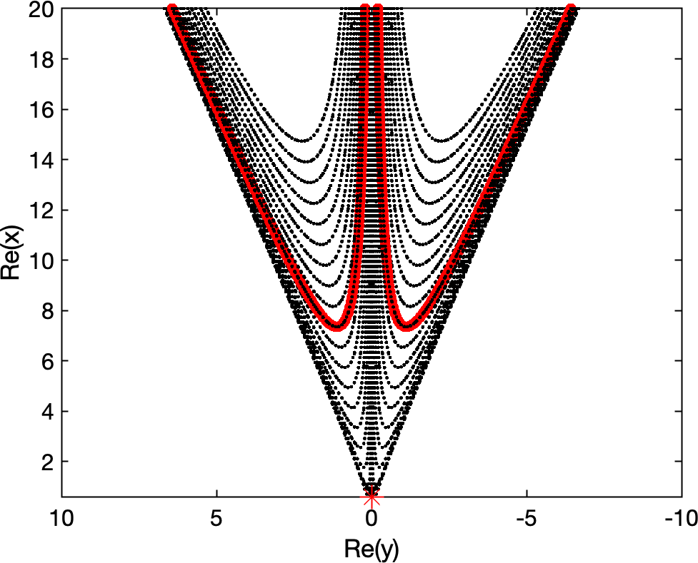
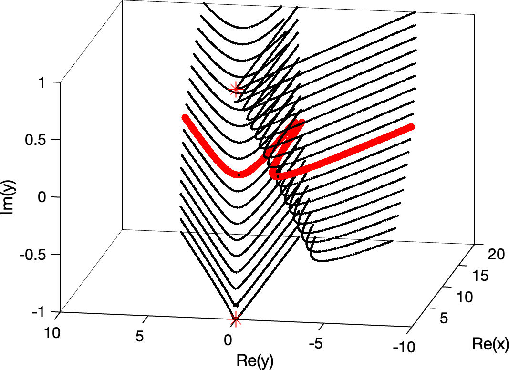

# Creation of the Stokes surface visualisation leading to Fig 8

**Original date:** 2019-12-10-ImyPlots

The following script in `call_plot.m` plots the relevant cross sections of level sets of $\chi$, which are related to the secondary switchings. When traced in one direction ('into the fluid') they eventually intersect with the source placed at z = -1. When traced into the other direction ('out of the fluid') the intersect with the mirrored source at z = 1.

The diagram in the publication only shows one set of contour lines.

You can manipulate the `.fig` file to examine the levels. The pure data can be extracted from `.fig` file as well. 